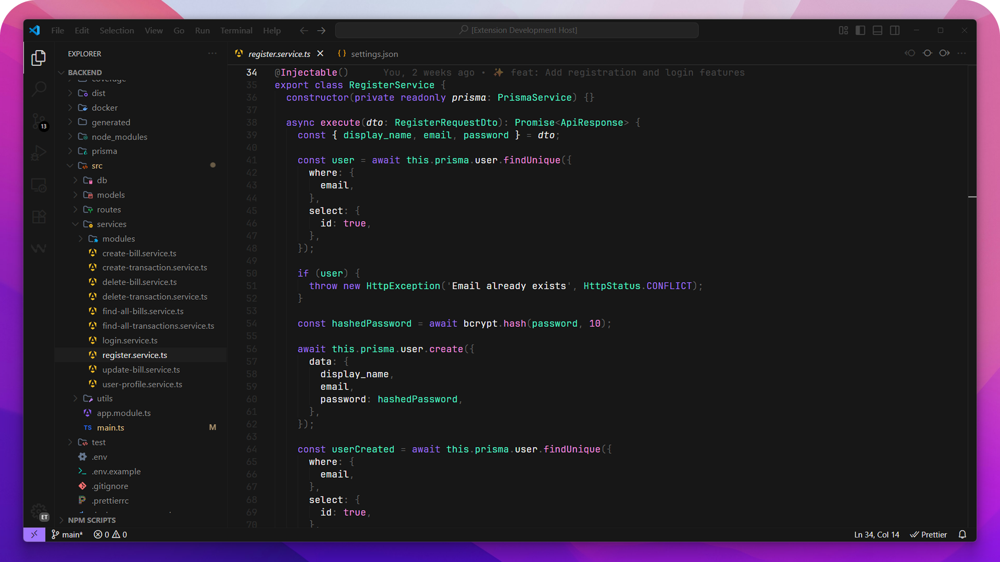
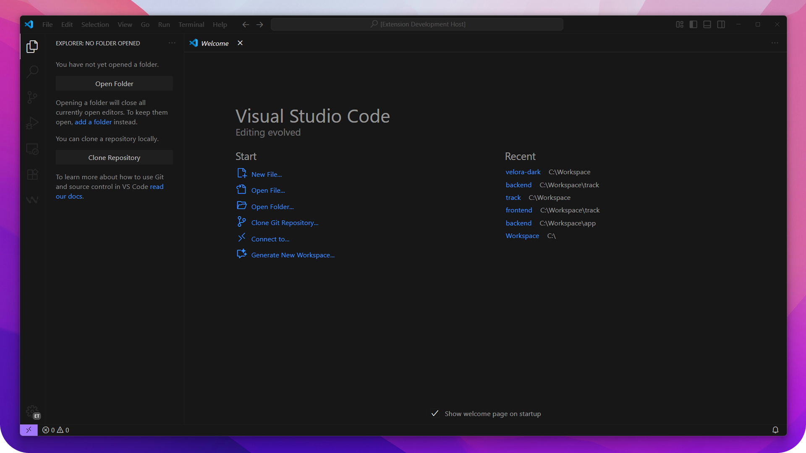

  
  &nbsp;&nbsp;
  
  &nbsp;&nbsp;
  
  &nbsp;&nbsp;
  

  

<h4 align="center">
Velora is a clean and aesthetic dark theme for Visual Studio Code, designed for a calm and focused coding experience. Minimal, modern, and built for developers who love a chill workflow.
</h4>

## 🎨 Preview

## 🚀 Installation

1. Open **Extensions** sidebar in VS Code
2. Search for `Velora`
3. Click **Install**
4. Go to `Preferences > Color Theme` and select **Velora Dark**

## 🤝 Contributing

Got ideas or issues? Open an [issue](https://github.com/euandresimoes/velora-theme/issues)  
or submit a pull request to improve **Velora**.

## 📜 License

[**MIT License**](https://github.com/euandresimoes/velora-theme/blob/main/LICENSE).  
Designed with 💜 for developers who love the night.
